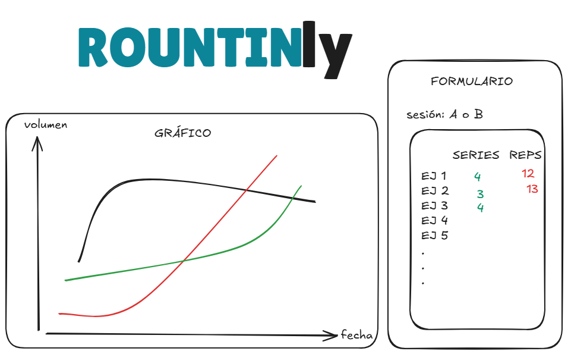

# ROUTINLY

Es un proyecto ideado para **llevar registro de mis rutinas de entrenamiento**. Consiste en ingresar los datos de cada sesión (series, repeticiones, peso, etc) y con ello **generar un gráfico** que evidencie la evolución en los aspectos nombrados.
Es un proyecto de uso personal que me desafía a profundizar mi conocimiento al ser una aplicación más cercana a proyectos reales en entornos laborales.
Está hecho con **Typescript** a través de **Vite**

